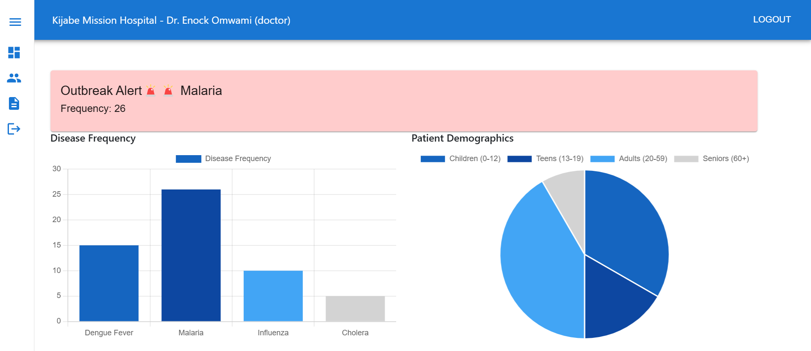
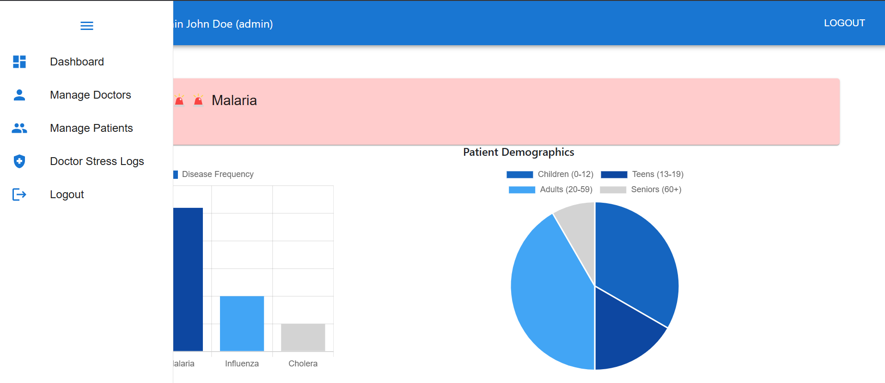

# Dawa Chat

## Overview

**Project Name**: Dawa Chat  
**Author**: David Nene  

**Topic**: Using Large Language Models and Knowledge Graphs to Improve Medical Drug Prescription and Advance Healthcare in Kenya.

The Dawa Chat project aims to leverage the power of Large Language Models (LLMs) and Knowledge Graphs to enhance medical drug prescription processes and improve healthcare delivery in Kenya. The project focuses on building an intelligent chatbot that can provide accurate and accessible prescription information from the Kenya National Medicine Formulary (KNMF).

## Objectives

- **Primary Outcome**: Develop an effective LLM-powered chatbot that enhances the retrieval of prescription information from the Kenya National Medicine Formulary (KNMF).
- **Goals**:
  - Implement a Retrieval Augmented Generation (RAG) process to improve the accuracy of medication-related data.
  - Reduce medication errors (MEs) and enhance patient safety in Kenya by providing reliable and timely prescription information.

## Technology Stack
- Frontend Github [link](https://github.com/davidnene/dawachat_frontend)
- Backend Github [link](https://github.com/davidnene/dawaChat)

### System Architecture


### Backend
- **Framework**: FastAPI
- **Database**: PostgreSQL (Data normalization)
### ERD Diagram


### Design Diagrams
#### Home page


#### Login page


#### Dashboard


#### Sidebar


#### Prescriptions Page


### Select Patient


### Add prescription


### View Prescription


### Edit Prescription


#### Open Dosage Query page


#### Dosage Query page


### [Frontend](https://github.com/davidnene/dawachat_frontend)
- **Framework**: ReactJS
- **Styling**: Bootstrap and Material UI

### Authentication and Authorization
- **Method**: Token-based authentication using JWT
- **Access Control**:
  - Only administrators can upload dosage files and create doctor profiles.
  - Doctors can query the system and provide prescriptions.

### Vector Database
- **Technology**: FAISS (Facebook AI Similarity Search) for efficient similarity search and retrieval.

### Natural Language Processing (NLP)
- **Library**: LangChain for advanced language model interactions and processing.

### Document Parsing
- **Library**: pdfplumber for extracting information from PDF documents.

### Features
- **Multi-format Support**: Capable of handling various document formats with real-time parsing and storage.
- **Metadata Extraction**: Enables advanced document categorization and retrieval through effective metadata extraction.

## Deployment

- **Containerization**: Docker for containerizing the application.
- **Orchestration**: Kubernetes for managing containerized applications.
  
## Query Agent
- **Chat Model**: ChatOpenAI for generating responses based on user queries.

## Setup Guide 
### Backend setup
```bash
# Clone backend repo and enter into the directory
git clone https://github.com/davidnene/dawaChat
cd dawaChat

# create a virtual environment and activate it
python -m venv .venv
. .venv/scripts/activate

# create a .env file and add the following
# ensure your postgres db is set up first
OPENAI_API_KEY='openai_key'
DB_USER=postgres
DB_PASSWORD=root
DB_HOST=localhost
DB_PORT=5432
DB_NAME=dawachat

# Install requirements
pip install -r requirements.txt
```

### Frontend setup
```bash
git clone https://github.com/davidnene/dawachat_frontend
cd dawachat_frontend
npm install

# Create a .env file and add the following
REACT_APP_BACKEND_BASE_URL=http://localhost:8000
```
### Docker compose setup
```bash
# Go back to the bakend repo
# Ensure you have docker active
docker-compose up --build

# open your browser and acess the server
http://localhost:3000

```
## Expected Outcomes
- Enhanced prescription information retrieval from the KNMF.
- Improved accessibility and accuracy of medication-related data.
- Reduced medication errors and increased patient safety, particularly in the Kenyan healthcare context.

## Conclusion
Dawa Chat aims to revolutionize how healthcare professionals in Kenya access medication information, ultimately contributing to safer and more effective patient care. By integrating advanced technologies such as LLMs and Knowledge Graphs, this project represents a significant step forward in the digital transformation of healthcare.