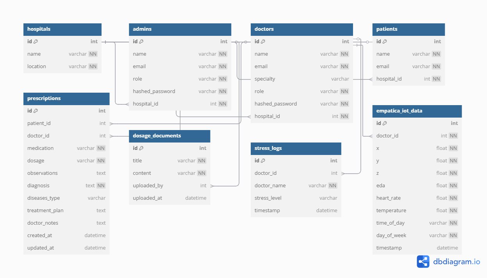

# Dawa Chat

## Overview

**Project Name**: Dawa Chat  
**Author**: David Nene  

**Topic**: Using Large Language Models and Knowledge Graphs to Improve Medical Drug Prescription and Advance Healthcare in Kenya.

The Dawa Chat project aims to leverage the power of Large Language Models (LLMs) and Knowledge Graphs to enhance medical drug prescription process and improve healthcare delivery in Kenya. The project focuses on building an intelligent chatbot integrated into a smart hospitl system that can provide accurate and accessible medical drugs dosage information from the Kenya National Medicine Formulary (KNMF).

## Objectives

- **Primary Outcome**: Develop an effective LLM-powered chatbot that enhances the retrieval of dosage information from the Kenya National Medicine Formulary (KNMF).
- **Goals**:
  - Implement a Retrieval Augmented Generation (RAG) process to improve the accuracy of medication-related data.
  - Reduce medication errors (MEs) and enhance patient safety in Kenya by providing reliable and timely prescription information.

## Technology Stack
- Frontend Github [link](https://github.com/davidnene/dawachat_frontend)
- Backend Github [link](https://github.com/davidnene/dawaChat)

### System Architecture


### Backend
- **Framework**: FastAPI
- **Database**: PostgreSQL (Data normalization)
### ERD Diagram


### Design Diagrams
#### Home page


#### Login page


#### Dashboard


#### Sidebar


#### Prescriptions Page


### Select Patient


### Add prescription


### View Prescription


### Edit Prescription


#### Open Dosage Query page


#### Dosage Query page


### [Frontend](https://github.com/davidnene/dawachat_frontend)
- **Framework**: ReactJS
- **Styling**: Bootstrap and Material UI

<!-- ### Authentication and Authorization
- **Method**: Token-based authentication using JWT
- **Access Control**:
  - Only administrators can upload dosage files and create doctor profiles.
  - Doctors can query the system and provide prescriptions.

### Vector Database
- **Technology**: FAISS (Facebook AI Similarity Search) for efficient similarity search and retrieval.

### Natural Language Processing (NLP)
- **Library**: LangChain for advanced language model interactions and processing.

### Document Parsing
- **Library**: pdfplumber for extracting information from PDF documents.

### Features
- **Multi-format Support**: Capable of handling various document formats with real-time parsing and storage.
- **Metadata Extraction**: Enables advanced document categorization and retrieval through effective metadata extraction.

## Deployment

- **Containerization**: Docker for containerizing the application.
- **Orchestration**: Kubernetes for managing containerized applications.
  
## Query Agent
- **Chat Model**: ChatOpenAI for generating responses based on user queries.

## Setup Guide 
### Backend setup
```bash
# Clone backend repo and enter into the directory
git clone https://github.com/davidnene/dawaChat
cd dawaChat

# create a virtual environment and activate it
python -m venv .venv
. .venv/scripts/activate

# create a .env file and add the following
# ensure your postgres db is set up first
OPENAI_API_KEY='openai_key'
DB_USER=postgres
DB_PASSWORD=root
DB_HOST=localhost
DB_PORT=5432
DB_NAME=dawachat

# Install requirements
pip install -r requirements.txt
```

### Frontend setup
```bash
git clone https://github.com/davidnene/dawachat_frontend
cd dawachat_frontend
npm install

# Create a .env file and add the following
REACT_APP_BACKEND_BASE_URL=http://localhost:8000
```
### Docker compose setup
```bash
# Go back to the bakend repo
# Ensure you have docker active
docker-compose up --build

# open your browser and acess the server
http://localhost:3000

``` -->
## Expected Outcomes
- Enhanced medical drugs dosage information retrieval from the KNMF.
- Improved accessibility and accuracy of medication-related data.
- Reduced medication errors and increased patient safety, particularly in the Kenyan healthcare context.

## Conclusion
Dawa Chat aims to revolutionize how healthcare professionals in Kenya access medication information, ultimately contributing to safer and more effective patient care. By integrating advanced technologies such as LLMs and Knowledge Graphs, this project represents a significant step forward in the digital transformation of healthcare.

## Update [23/04/2025] - Added Stress Detection ML Module

### **Psychological Stress Detection with Ensemble Machine Learning Techniques**
### **Background**

The widespread adoption of wearable technologies has opened up novel avenues for real-time health monitoring, particularly for detecting stress. In high-stakes environments like hospitals, stress detection is crucial for safeguarding the mental well-being of healthcare workers. Physiological signals such as Electrodermal Activity (EDA), Heart Rate (HR), and Skin Temperature (TEMP) serve as useful biomarkers for stress recognition. This project focuses on a dataset derived from hospital nurses who wore Empatica E4 devices during their shifts, enabling continuous data collection in a real-world setting.

By leveraging this rich physiological dataset, the study aims to develop and compare ensemble machine learning models to classify stress levels. This work supports the integration of intelligent systems in hospital environments that proactively monitor and report stress, improving the work environment and health outcomes for medical staff.

### **Problem Statement and Justification**

Stress among healthcare professionals poses significant risks to both staff well-being and patient care. Detecting stress early and accurately is challenging due to the complex interplay of physiological and environmental factors. Traditional surveys and self-reports often fall short in capturing real-time stress levels.

This study aims to implement and compare robust ensemble machine learning classifiers—LightGBM, XGBoost, and Random Forest—on wearable-derived physiological data to predict stress levels. The rationale is to identify an effective model that can be embedded into a smart hospital system, enabling timely interventions based on real-time data analytics.

**ML Training Data Source**

The dataset was collected from 15 female nurses over two separate periods during routine hospital shifts. The Empatica E4 wearable device was used to collect biometric signals at high frequency, capturing:

- Electrodermal Activity (EDA)

- Heart Rate (HR)

- Skin Temperature (TEMP)

- Orientation data (X, Y, Z)

- Time-based labels: 0, 1, or 2 representing increasing stress levels

Additional smartphone-based surveys were periodically administered to provide contextual information. The dataset comprises ~11.5 million entries across nine columns and is publicly available on Dryad.

**System Integration Use Case**

The selected machine learning model (XGBoost Classifier) will play a central role in real-time stress monitoring for doctors. Wearable devices worn by doctors will continuously transmit physiological data, such as heart rate, electrodermal activity, and temperature, to a centralized system at five-minute intervals. When a doctor logs into the system, the backend automatically retrieves the most recent five physiological records associated with that individual. These data entries are then passed through the trained model, which generates class probabilities for each stress level: no stress, mild stress, and severe stress.

To determine the doctor's current stress status, the system calculates the average of the predicted probabilities across the five records. The class with the highest average probability is selected as the final prediction. If the model outputs a label of either mild or severe stress, the system immediately logs this incident in the stress detection table. This entry includes the predicted stress level, the doctor's unique identifier, and the exact login timestamp.

From the administrative interface, system administrators can access a daily summary dashboard that displays all doctors flagged with stress on that day. Each entry includes the doctor’s name, stress level detected, and the time the stress was identified, enabling timely interventions and mental health support within the hospital environment.

#### Stress Detection Page (Admin)


#### Stress Level Detected (Admin)
